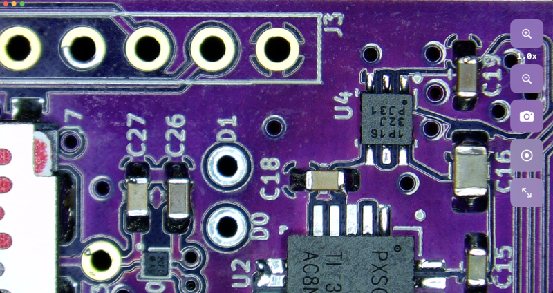

# MicroApp

A native macOS app for viewing live video from a benchtop microscope via an HDMI-to-USB capture card (e.g. MS2130). Capture still images, record video, and digitally zoom — all with a touch-screen-friendly UI.



## Features

- Live video preview from external USB capture cards
- Still image capture (PNG, saved to Desktop) with digital zoom cropping
- Video recording (MOV, saved to Desktop)
- Digital zoom (1.0x–5.0x)
- Reset-to-native-size button for pixel-perfect viewing
- Touch-friendly controls (minimum 70pt touch targets)
- Automatic device connect/disconnect handling

## Requirements

- macOS 14+ (Sonoma, Sequoia, or Tahoe)
- Apple Silicon Mac
- Xcode Command Line Tools
- USB HDMI capture card

## Build

```bash
./build.sh
```

This builds the app, assembles the `.app` bundle, code signs it, creates a `MicroApp.dmg`, and launches the app.

## Install from DMG

A pre-built `MicroApp.dmg` is included in the repository. Double-click to mount it and drag `MicroApp.app` to your Applications folder.
